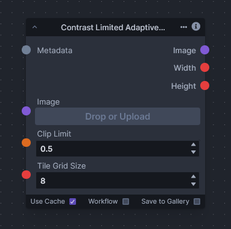

# Contrast Limited Adaptive Histogram Equalization

Contrast Limited Adaptive Histogram Equalization (CLAHE) is an advanced image processing technique that aims to improve the contrast in images. Unlike standard histogram equalization, which applies a global contrast enhancement, CLAHE operates on small regions in the image called tiles or blocks, rather than the entire image. This localized approach prevents the over-amplification of noise which is a common drawback of global histogram equalization.

The algorithm divides the input image into a grid of non-overlapping tiles, then applies histogram equalization to each tile independently. To mitigate the issue of noise amplification in homogeneous areas, CLAHE introduces a contrast limiting step. This step involves clipping the histogram at a predefined value before computing the cumulative distribution function. If any histogram bin is above the specified contrast limit, the excess is distributed evenly to other bins before applying the histogram equalization. This redistribution of intensity values prevents the overemphasis of any particular brightness level within an image.

After histogram equalization is applied to each tile, the borders between tiles will likely be discontinuous. To solve this, CLAHE interpolates the pixel values at these borders, resulting in a smooth transition between adjacent tiles.

CLAHE is particularly useful in scenarios where you need to enhance the local contrast and define edges in each region of an image without significantly altering the overall image appearance.
